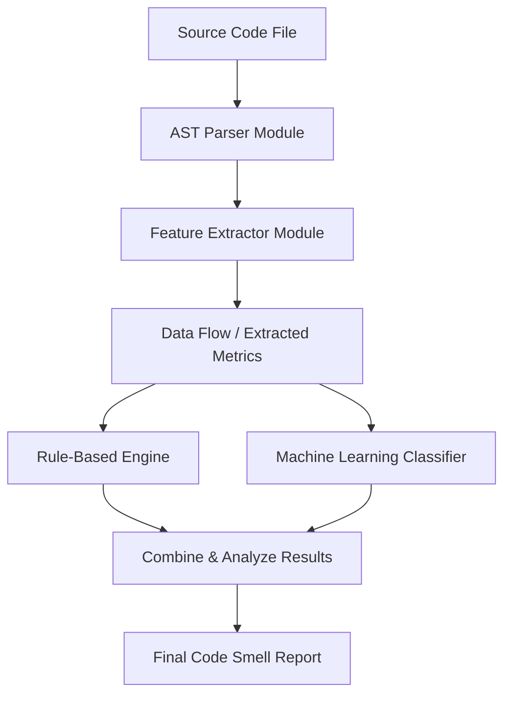
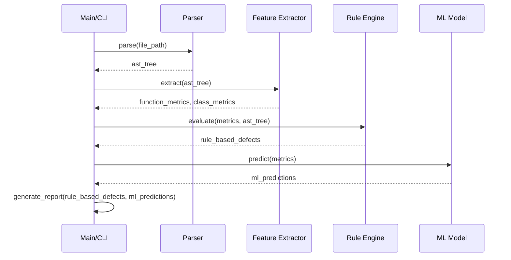
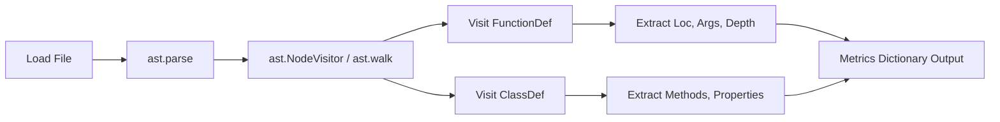

# System Architecture & Design

## Overall System Architecture

```mermaid
graph TD
    A[Source Code File] --> B[AST Parser Module]
    B --> C[Feature Extractor Module]
    C --> D[Data Flow / Extracted Metrics]
    
    D --> E[Rule-Based Engine]
    D --> F[Machine Learning Classifier]
    
    E --> G[Combine & Analyze Results]
    F --> G[Combine & Analyze Results]
    
    G --> H[Final Code Smell Report]
```

## Module Interactions

```mermaid
sequenceDiagram
    participant CLI as Main/CLI
    participant AST as Parser
    participant FE as Feature Extractor
    participant RE as Rule Engine
    participant ML as ML Model
    
    CLI->>AST: parse(file_path)
    AST-->>CLI: ast_tree
    CLI->>FE: extract(ast_tree)
    FE-->>CLI: function_metrics, class_metrics
    CLI->>RE: evaluate(metrics, ast_tree)
    RE-->>CLI: rule_based_defects
    CLI->>ML: predict(metrics)
    ML-->>CLI: ml_predictions
    CLI->>CLI: generate_report(rule_based_defects, ml_predictions)
```

## AST Parsing Workflow

```mermaid
graph LR
    P1[Load File] --> P2[ast.parse]
    P2 --> P3[ast.NodeVisitor / ast.walk]
    P3 --> P4[Visit FunctionDef]
    P3 --> P5[Visit ClassDef]
    P4 --> P6[Extract Loc, Args, Depth]
    P5 --> P7[Extract Methods, Properties]
    P6 --> P8[Metrics Dictionary Output]
    P7 --> P8[Metrics Dictionary Output]
```
